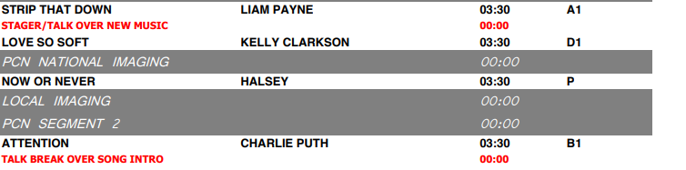

# Night Show Producer v1.0

Night Show Producer is a simple program that turns a "music log" PDF file (generated by a music scheduling app such as Selector or Music Master), a directory full of songs, a collection of dry audio pieces from a radio disc jockey, and exports a fully-produced radio show, complete with imaging pieces between songs, custom new music intros, automated music beds, and then segments them into their appropriate pieces, completely ready for on-air play.  **All with the click of a few buttons!**

### Table of Contents
* [Introduction](#INTRODUCTION)
* [Installation](#INSTALLATION)
* [Usage Instructions](#USAGE)
* [Contributors](#CONTRIBUTORS)
* [Test Instructions](#TESTS)
* [Questions | Contact](#QUESTIONS)
* [Goals](#GOALS)
* [License Information](#LICENSE)

### Introduction

This is the program that started it all!  The app that ultimately led my down the path of wanting to be a developer.  It's not much to look at, but I'm proud of it, and it laid the foundation for what became a newfound hobby and hopefully what becomes my career.

I had zero experience with Java before embarking on this adventure, and ended up taking an amazing online Java course taught by the University of Helsinki called MOOC: https://java-programming.mooc.fi/

This project started with a simple Google search: `"mix audio files java"`

#### History

While most radio shows today are generated through really expensive automation software, such as iHeartRadio's Zetta (NexGen), a lot of shows are still put together - to this day - the old fashioned by: by hand, through laborious repeated manual labor of dragging virtual boxes around over and over again.

##### The Process Before

* A music director would generate a "music log" through their scheduling software of choice, which would create either a PDF or a TXT file of the sequence of events that comprise the radio show: songs, DJ talk breaks, commercials, imaging pieces ("sweepers"), and others.  Here is the log used in the demo for this app: 

**(full PDF available in repository)**
;

* A producer would then build each segment by placing the elements in an audio editor's linear timeline.

As you could imagine doing this process repeatedly, day after day, over and over could quickly become tiresome and drive you crazy.  Combine that with a lack of passion for the music, and not being in the target audience of the radio show, I decided to come up with an alternate method to complete this daily task: Night Show Producer!

### Installation

**Please note: This required Java SDK 8 to run.**

`git clone https://github.com/infiniteoo/night_show_producer.git`

Everything you need to to run this is available in this respository with the exception of the actual music library itself.  Obviously, because of copyright concerns, I cannot give you a directory of 100+ commercial licensed songs, so you will need to build it yourself.

Simply edit the `./pcn/pcn library.txt` to match your song names, which are placed in the `./pcn/library` directory.

### Usage

**If you'd like to mix down the entire log, top to bottom:**

* Leave "Whole Show" selected.
* Click "Open File" in the top middle labeled "Music Log" and select the supplied PDF.
* Click the "Auto Mix" check box.
* Click "Prepare"

This will enact the chain of events to begin mixing down the show.  The WAV audio files will be exported to your projects main directory: `./`.

**If you'd prefer to just mix down one segment, rather than the whole show:**
* Select "Single Segment"
* Input the hour and segment number
* Click "Auto Mix"
* Click "Prepare"

### Contributors

This project would have been completely impossible without the amazing source code of **Matthias Pfisterer**, whose libraries `AudioContact.java` and `MixingAudioInputStreams.java` which were acquired from **jsresources.org**

My limited programming skills at this point would have never been able to pull this off without the help they provided, and am forever indebted to him.  This project ultimately lead me to a coding bootcamp, and now I am hooked!

### Example

As mentioned before, because of copyright concerns, I cannot simply distribute commercially licensed music, but I still wanted to give you a small example of the final product this program provides.

In the `./pcn/example` directory you'll find the audio files created by this program, but with all of the copyrighted music cut out, leaving only the transitional pieces, and the disc jockey talk segments.

## Questions

troydorman@gmail.com

## Goals

* I'd like to get this app 'finished'.  It works, just barely, but I'd love to keep applying newly-learned Java skills on improving this project over time.  First step: **finishing it**.

* Ultimately, this program is garbage without getting the audio mixing right.  What takes my program over an hour to do, takes Adobe Audition fifteen minutes.  Still, this program takes less time than a human doing it by hand, so it was still worth creating.

* Will add more goals, but until we get an M.V.P. (minimum viable product), there's no reason aiming for the stars.

## License

